# Event-Triggered Averages—a tutorial

Event-triggered averages, also known as Peristimulus Time Histograms (PETHs) are
a method of analysis commonly used in neuroscience, but also in the finance
industry and others. They were even used in recent posts by Facebook's Data
Science team:

- [The Formation of Love](https://www.facebook.com/notes/facebook-data-science/the-formation-of-love/10152064609253859)
- [When Love Goes Awry](https://www.facebook.com/notes/facebook-data-science/when-love-goes-awry/10152066701893859)

They are used to determine the effect of triggered events (or spikes) on
timeseries data. To create the event triggered average, we consider many events
and average the responses to each. This smoothes out the irrelevant chatter to
give a more pure, distilled representation of the response.

The original use, in neuroscience, was to measure the response (in a plot of
brainwaves) to a stimulus. For example, the experimenter might measure a rat's
brainwaves over a twenty minute period. Every minute, the rat is fed a piece of
cheese (the stimulus or event). Since the rat's brain is responding to many
things at any given moment, no single response is assumed to be reliable. But if
we take the 15 seconds of response surrounding each stimulus and average all of
those responses, we dampen much of the jitter. Only those relationships that
show up in many observations are present in the average.

We will use Game 2 of the 2012 World Series as our example data. The ratings are
our 'response'. We will use the starts of commercial breaks as the events.

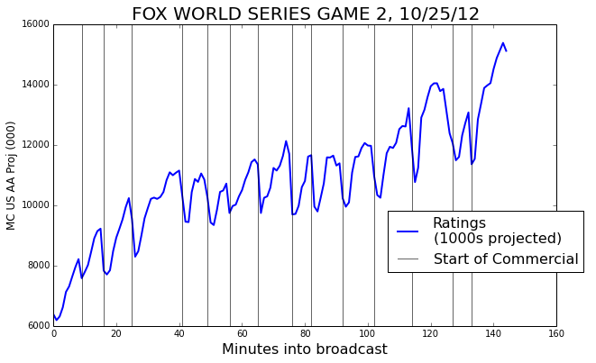

### The events

In order to do an event triggered average we need some events to be our
triggers. To begin with, we'll use the starts of each commercial break as our
events. We'll take a window around each event—7 minutes before and
after. Plotted below is an example of such a window.

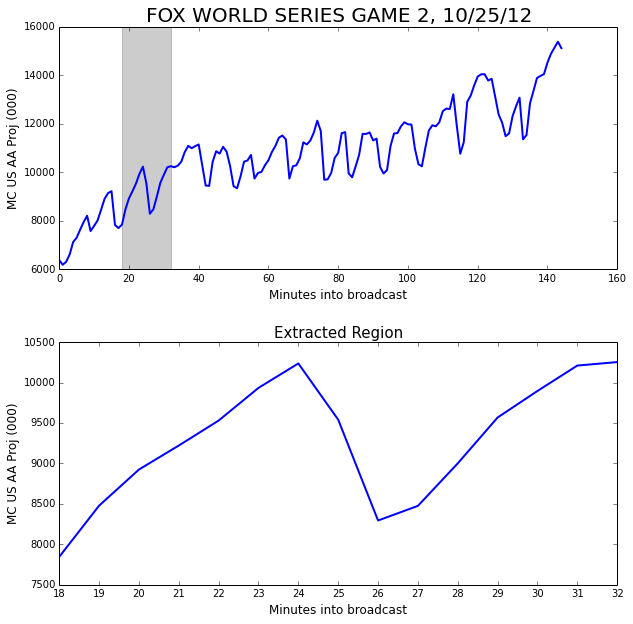

One window isn't very interesting. We really ought to be considering a whole
bunch; otherwise why bother averaging?

Let's add a few more.

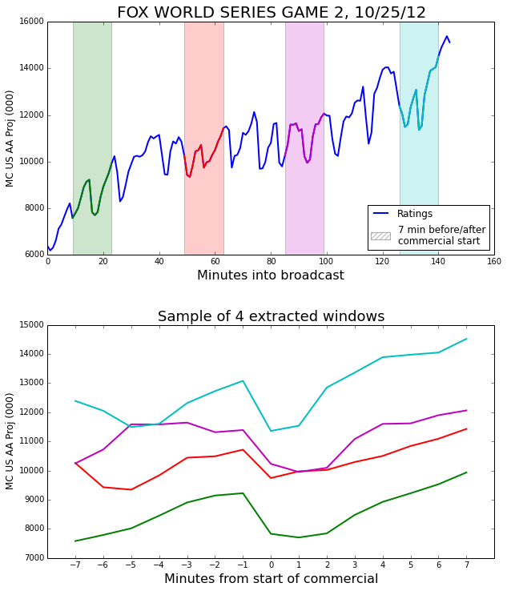

Now that we have a sense of where the observation windows are coming from, we
can look at all the observations separately, and also in the average.

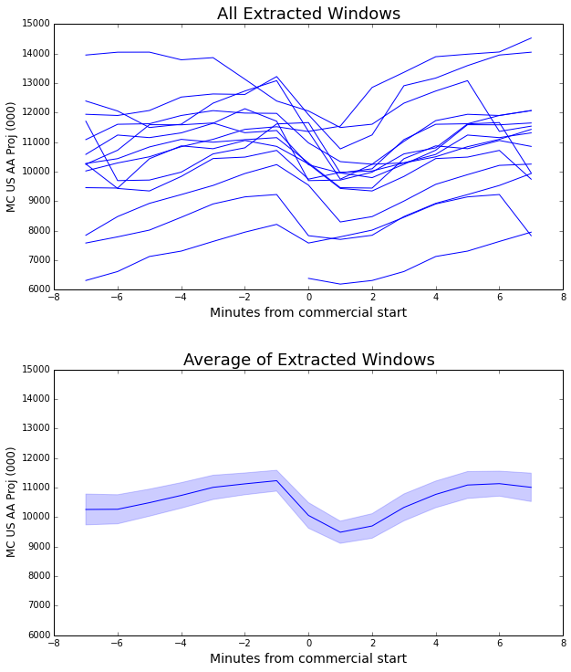

Since this curve is formed by an average of many windows, it represents the
_general case_ of what happens surrounding a commercial break.

We can make some observations from it. The steep drop between -1 and 0 minutes
before start of commercials indicates that most viewers who will leave during a
commercial leave right away. There is a smaller drop between 0 and 1 minutes
after start of commercial, and then viewership begins to recover. By the 5
minute mark, the viewership is back to its previous level.

The pale blue band around the curve represents the standard error of the mean.

### Significance

How can we be sure that this averaged curve has any significance, that it really
has any relationship to the events that triggered it?

One way is the error band. We have a pretty narrow error band in the plot above.
However, if the error band had been much larger than the scale of the changes in
the average curve, the changes would not have been very important.

But we can do better. We want to know if this choice of event (commercial
starts) had a significant effect on event average. So we can compare it to a
control group of randomly positioned events. When we create one of these event
triggered average curves using random values as the events we call it the 'noise
curve'. The event triggered average using the actual group of events is
significant if it deviates from the noise curve enough to escape the error
bands.

Because we might have only a small number of events, we will do a large number
of trials, say 100, to ensure that our noise curve is stable.

We choose the same number of random events to construct the noise curve as we
have actual events. The random events from a single trial are plotted below as
black vertical lines.

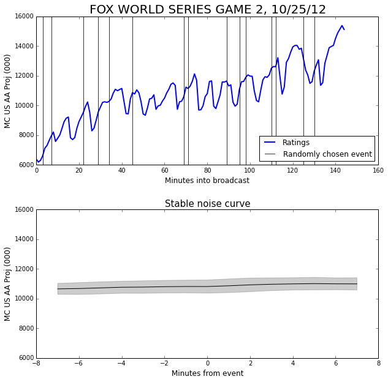

Each trial using random experiments produces a guess at the mean. The mean of
these guesses gives us the stable noise curve. The standard deviation of the
guesses gives the width of the error band above and below the noise curve.

It's a little hard to tell at this scale, but the noise curve has a slight
upward slope. This reflects the fact that the general trend is that the ratings
are increasing. In fact, the slope (which is about 30) gives the average ratings
increase per minute.

Now we can combine the noise curve with the curve for the commercial breaks to
see the size of the effect.

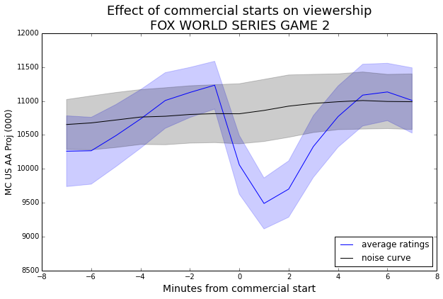

Now that we have the noise curve to give us some context, we can see that the
viewership has a significant decline prompted by the start of the commercial.
Since the distance from the noise curve to the blue curve is about 2.5 times the
standard deviation of the noise band, this effect has greater than 99%
confidence.

### Computing a p-value

Treating the noise curve as our control and assuming equal variance, we can
compute a p-value for a particular dip or bump via the following process:

1. Take the difference between the noise curve and the average ratings curve.
2. Divide by the standard error of the noise curve to give a z-score.
3. Use your favorite method to turn the z-score into a p-value (table or
   equation). I tend to use a 1-tailed test.

**Note**: In step 1, it is also acceptable to use a change in the average
ratings curve itself. For example, in the plot above, we might take the
difference of the average ratings curve from minute -1 to minute 1. This can be
a good idea when your noise curve is wholly above or below the event average
curve.

### Effect size

While the p-value is a measure of how sure we are that the events had an effect
at all, we also care about the size of the effect. This can be read straight off
the graph. For example, in the plot above, we could say that the start of a
commercial break during Game 2 of the World Series induced a ratings drop of
about 1500, on average. In some cases, it may be more meaningful to speak in
terms of percent-changes rather than absolute values.

## Multiple series

We can apply the event triggered average technique to more than one signal
simultaneously. Let's add another curve to the mix: the number of tweets posted
about the World Series each minute as collected by SocialGuide.

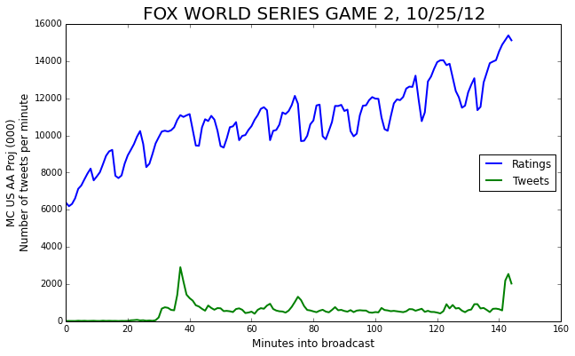

We can compute the event triggered average of this new series as well.

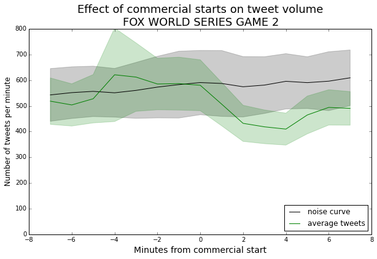

We can see that the tweets curve just barely escapes the noise curve. This says
that, for this particular broadcast, commercial breaks don't have a strong
effect on tweet volume.

**Editor's Note:** This is something of an anomaly. Most shows have an increase
in tweets during the commercial breaks. I have a couple of guesses for why this
should be the case. People viewing the World Series may be watching in groups,
so they are talking rather than tweeting during the breaks. It could also be
that viewers are tweeting in-the-action more often.

## Different choices of events

So far, the only events in our event-triggered-averages have been the starts of
commercial breaks. However, we can also use attributes of the signals themselves
as events. For example, we might be curious about how tweets tend to behave
around a peak in the ratings graph. In the curve below, we mark the locations of
rating peaks, and then show the event-triggered averages using the peaks as
events.

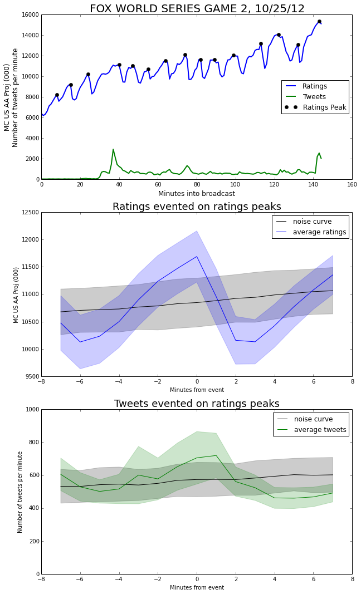

Immediately after the ratings peak, viewership drops abruptly (It doesn't make
it out of the noise band, but the change in value is large enough to comment
on). Part of this is likely just a return to normal levels, but I think part is
due to the fact that there is often a stoppage of play just after an exciting
event. This makes for a good time to go to commercial.

One of the main benefits of event triggered averages is that we can be very
selective with our definition of an event. For example, we can choose our events
to be tweet peaks—but only the ones that occur during a commercial
break.

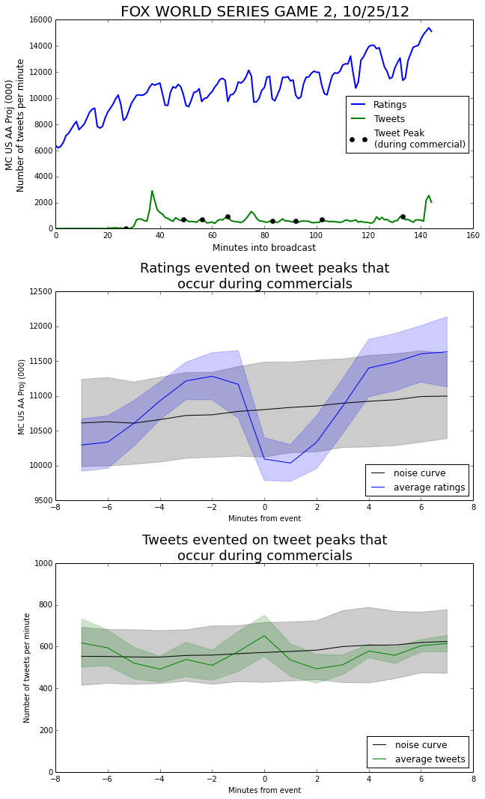

In the ratings curve, we observe a very similar dip as we saw earlier when we
evented on commercial starts. This makes sense, because 'tweets peaks during
commercials' is a pretty good proxy for the commercials themselves.

We can also see that the tweet curve more or less stays within 1 standard
deviation of the noise curve the whole time. Even though we evented on tweets,
the number of tweets doesn't vary much from its baseline during commercial
breaks.

Looking at the plot of the whole broadcast, we can see that all of these events
are small compared with the three much larger peaks at minutes 37, 78, and 143.
So, although there was an uptick in tweets during commercials, it was a smaller
effect. Most of the tweeting happened in-the-moment, during the show.

We can run the complementary process and use only the tweet peaks the _didn't_
occur during a commercial.

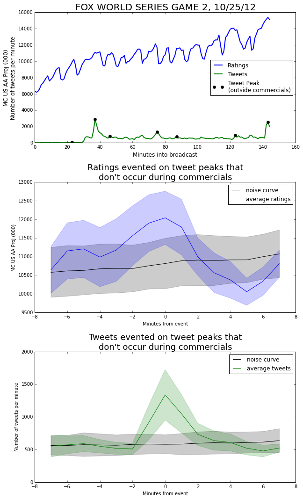

Taking a look at the ratings graph, we can see that the tweet events are
associated with an increase in the ratings. This makes sense—when the
game is exciting it causes more people to watch and more people to tweet. The
distance from the noise curve to the ratings curve is about 1.655 times the
standard deviation of the noise curve. This gives a p-value of about 0.0495,
just making it into a 95% confidence level.

### Multiple shows

We've focused on only one show, for simplicity. However, it is valuable to draw
events from multiple shows. For example, we could create an event triggered
average over all basketball games, where an event is triggered whenever a team
scores a basket that puts them in the lead.

By averaging over many episodes, we have a larger pool of events. This decreases
our standard error, and makes it easier to find significant results.

Because different shows have vastly different viewerships and tweet volumes, it
probably makes sense to normalize within each episode, or at least within each
show. That is, subtract the mean and divide by the standard deviation of each
episode.
