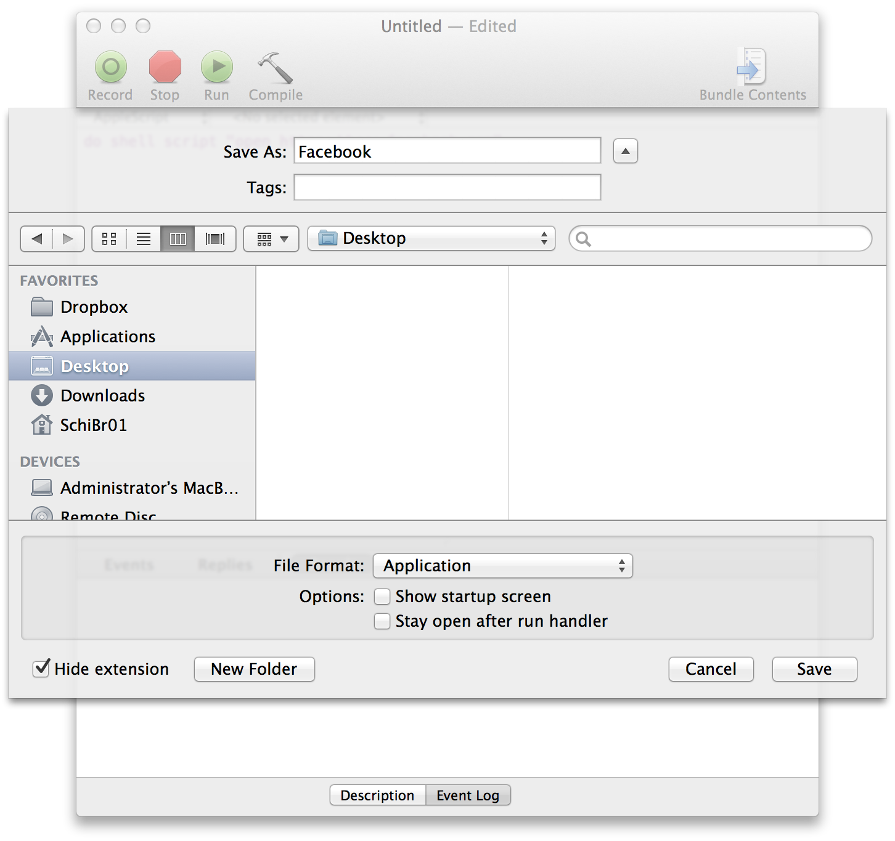
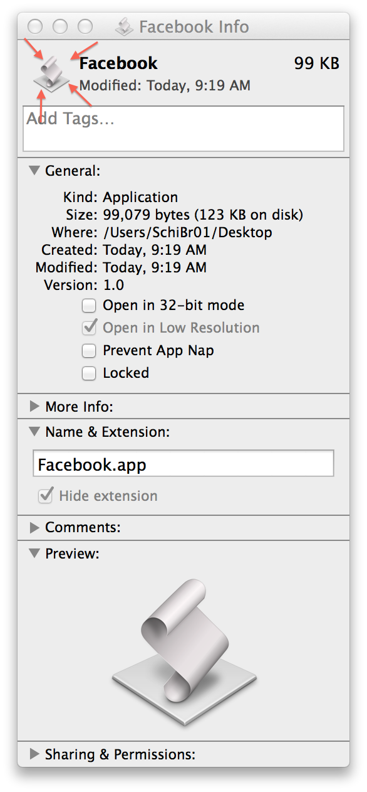
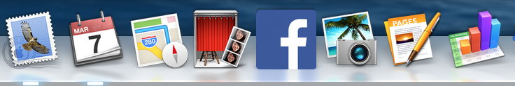

Some time ago, my (now) mother-in-law switched to a mac. She had already been using an iPhone for a while, so it was a familiar interface. One thing that was unfamiliar: there's no Facebook app!

It does seem a serious oversight on Facebook's part. Well, luckily it's not too difficult to rectify. We'll walk through creating a very comprehensive Facebook app. This is an OS X-specific tutorial, though I may make a cross-platform version in the future.

Open up a terminal and type `open https://www.facebook.com`. Facebook should open in a new tab in your default browser. Great!

import { Image } from 'astro:assets';
import mvp from './mvp.png';

<figure>
    <Image src={mvp} alt="a terminal window shows 'open https://www.facebook.com'" />
    <figcaption>Looks like we've got our minimum viable product!</figcaption>
</figure>

Open up the AppleScript Editor and type

```applescript
do shell script "open https://www.facebook.com"
```

It should look like this:

import applescript from './applescript.png';

<figure>
    <Image src={applescript} alt="AppleScript Editor with 'do shell script 'open https://www.facebook.com''" />
    <figcaption>Not only is the code clean, but it scales well too.</figcaption>
</figure>

Now save that file, but where it says File Format, choose Application.



This is a working application—try opening it. Facebook should spring fully-formed into your web browser. We could ship this now, but I think it lacks a certain aesthetic touch.

Find a nice looking version of the facebook logo. Here's one that's 800x800 pixels:


Open up this logo, select-all (⌘ + a), and copy (⌘ + c). Now right-click (or control-click) your app, and choose 'Get Info'.



Click the icon in the top left corner. This should give it a blue border, indicating that it's highlighted. Now paste the logo (⌘ + v). Close out of the 'Get Info' window, and you're done!

All joking aside, this is could be a useful technique for setting up a computer for a relative who's not very computer-savvy. You can even drag the icon to the dock to make it easy to find.



As promised, a link for the lazy: <a href="/facebook.zip" class="btn">download the facebook app</a>
