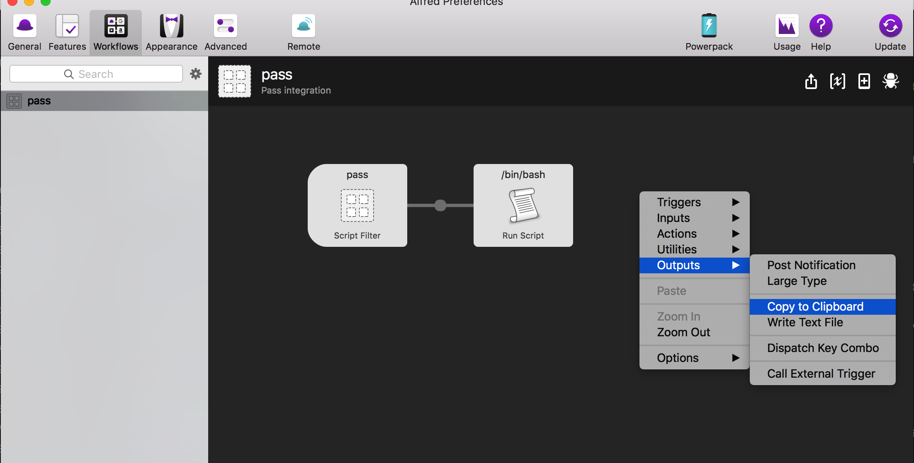

Originally published on 2016-08-31. Updated on 2017-07-11. Updated on 2018-07-03.

File this under the category of 'Notes for my future self so I don't have to figure this all out from scratch again'. Hopefully it will be useful for someone trying to do a similar thing.

I was trying to set up [pass](https://www.passwordstore.org/), an open source password manager, exactly the way I wanted it:

- gpg-agent should remember my master password until I put my computer to sleep, even between two different terminal sessions.
- a hotkey to search (with autocomplete) through the available accounts and put the password on my clipboard.

Really those don't seem like such tough requests. Here's what I did.

1. Install pass with `brew install pass`. Nothing too complicated here. Add some passwords so you can test out the other steps.
2. Install GPG with `brew install gnupg`. It's important to get GNU 2.1 or higher, but that's now the default. (We need at least version 2.1 because that is when `--use-standard-socket` began to default to true.
3. Edit your `~/.gnupg/gpg-agent.conf` (create that file if it doesn't already exist) to include the line `max-cache-ttl 7200`. Choose a number of seconds that works for you. After that much time has elapsed, gpg-agent will forget your master password.
4. Install sleepwatcher with `brew install sleepwatcher`. Sleepwatcher will let us run a script when the computer goes to sleep and when it first wakes up.
   1. Create your 'on sleep' script by creating a file at `~/.sleep` containing just one line: `echo RELOADAGENT | /usr/local/bin/gpg-connect-agent`. Make sure the file is executable by running `chmod 0700 ~/.sleep`.
   2. Run `brew services start sleepwatcher`. This is a replacement for `launchctl load ...` that you may see on other tutorials. If you change your `~/.sleep` or `~/.wakeup` scripts, you may need to run `brew services restart sleepwatcher` for the change to take effect.

At this point, you could call it quits. The instructions so far are sufficient to avoid typing your master password more often than necessary. The rest of the instructions cover how to get the hotkey and autocomplete behavior, like 1Password has.

1. Install Alfred if you don't already have it. We're going to use [CGenie/alfred-pass](https://github.com/CGenie/alfred-pass) to get the hotkey and autocomplete behavior. It's a custom Alfred workflow, so you'll need to spring for the paid version.
2. Install pinentry-mac with `brew install pinentry-mac`. Configure gpg-agent to use this for entering your master password by adding the line `pinentry-program /usr/local/bin/pinentry-mac` to your `~/.gnupg/gpg-agent.conf`. You'll have to restart gpg-agent for this to take effect: `killall gpg-agent`.
3. Install [CGenie/afred-pass](http://www.packal.org/workflow/pass-0).
4. From the Alfred preferences, go to workflows. Right click on 'pass' and go to open in finder. Open up `pass-show.sh` in a text editor.
   1. Because we're using gpg 2.1 or higher, we can comment out the whole section labeled `GPG Agent`-- the if-statement and envfile bit.
   1. Comment out the line at the bottom that says `pass show -c $QUERY` by putting a `#` at the front. I found that using the `pass -c` flag meant I could only get one password every 45 seconds -- I had to wait until `pass` cleared my clipboard for some reason.
   1. Uncomment the line above it and remove `| pbcopy` from the end. That is, change it from `#pass show $QUERY | awk 'BEGIN{ORS=""} {print; exit}' | pbcopy` to `pass show $QUERY | awk 'BEGIN{ORS=""} {print; exit}'`. We're doing this because one of the coolest features of Alfred is clipboard history, but using `pbcopy` this way puts your passwords into that history, where they could be snooped. That's no good! We'll get Alfred to put it on your clipboard but not your history in the next step.
   1. In the previous step, we modified the script to echo your password to stdout instead of putting it on the clipboard. Now, right click on the workflow screen in Alfred, choose Outputs > Copy to Clipboard.



Check the box for 'Mark item as transient in Clipboard' and save. Drag the little nubbin on the right of the 'run script' box to the new clipboard box. It should look like this when you're done.


And we're done. Now you can bring up Alfred with your hotkey, type pass, and you'll have autocompleted passwords on your clipboard, but not your clipboard history.


We've reached another good stopping point. However, my last little nitpick is that I don't love the pinentry-mac program when I'm using `pass` at the command line. It's necessary for alfred, since there's no terminal where I could be typing my master password. But I find it's slower than the ncurses based default.

My method is based on this Stack Overflow post: [Change pinentry program temporarily with gpg-agent](https://unix.stackexchange.com/questions/236746/change-pinentry-program-temporarily-with-gpg-agent). We'll make a wrapper program that hands off to one of two `pinentry`s. Here's what mine looks like:

```
#!/bin/bash
# choose pinentry depending on PINENTRY_USER_DATA
# requires pinentry-curses and pinentry-mac
# this *only works* with gpg 2
# see https://bugs.debian.org/cgi-bin/bugreport.cgi?bug=802020

case $PINENTRY_USER_DATA in
gui)
  exec pinentry-mac "$@"
  ;;
*)
  exec pinentry "$@"
esac
```

Save this to somewhere on your `PATH` and make it executable. I called mine `~/bin/my-pinentry`. Now edit `pass-show.sh` above to pass the right environment variable:

```
#!/bin/bash

set -e

QUERY=$1
PATH=/usr/local/bin:$PATH

PINENTRY_USER_DATA=gui pass show "$QUERY" | awk 'BEGIN{ORS=""} {print; exit}'
```

This way, we get to use the (faster) ncurses `pinentry` in the terminal, and the GUI version when necessary.
