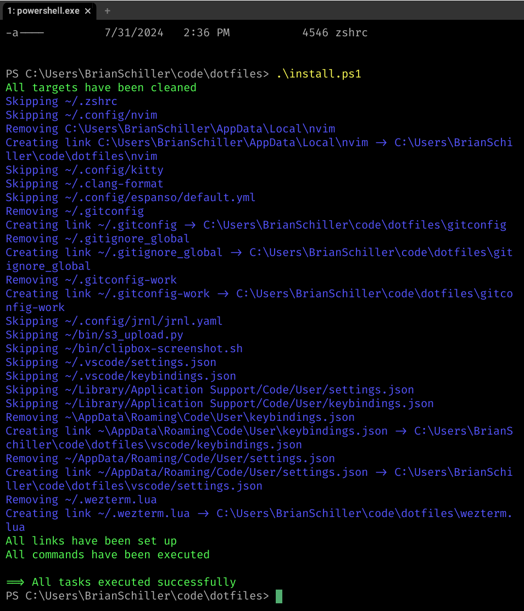
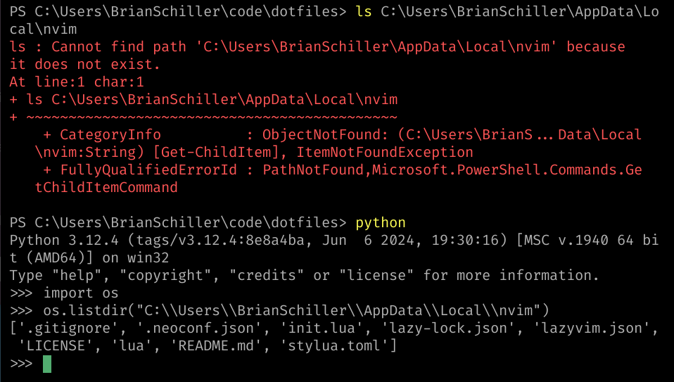
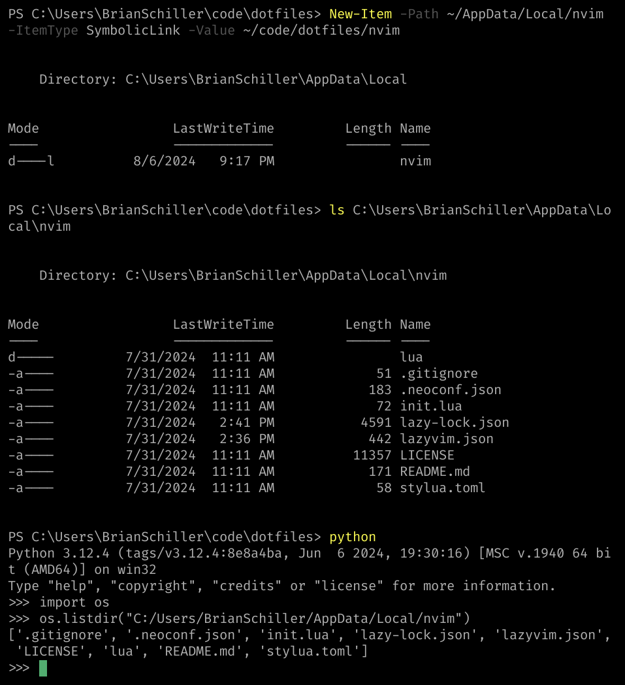

Dotbot is a tool for managing dotfiles. It's a shell script (bash or powershell) that creates symlinks from a git repository to the right locations on your system. It uses a yaml file to specify the links.

My work requires testing on Windows, so I've recently needed to set up a Windows machine for development. I found a few examples online of using `dotbot` to manage dotfiles on Windows, but they mostly relied on creating "profiles" and using different yaml configurations depending on the OS. I preferred to keep a single configuration file. Here's how it worked out.

Dotbot's config items have an `if` key that can be used to conditionally include or exclude a symlink based on a shell command. Most of the examples are for Linux/macOS differences and look like this:

```yaml
~/.hammerspoon:
  path: hammerspoon
  if: '[[ "$(uname)" == "Darwin" ]]'
```

But `uname` doesn't exist on windows, so we have to use something else. I found that I could use `ver`, which is a command that prints the Windows version, for windows-specific paths and `uname` for things that should run for both mac and linux. I used it like this:

```yaml
- link:
  ~/.gitconfig: # No `if:` means it will link on all platforms
  ~/.config/nvim:
    if: uname # Only link on macOS and Linux
  ~/AppData/Local/nvim:
    if: ver # Only link on windows
```

This should have worked, and it seemed to! I had to run `.\install.ps1` from a "Run as Administrator" terminal (creating symlinks on Windows is a possible security risk for some reason), but I got all success messages.



Unfortunately, some of the symlinks don't seem to work. In particular, any symlink to a directory seems to have failed. Oddly, `python` can still see an follow the symlink. If I run `ls C:\Users\BrianSchiller\AppData\Local\nvim` in powershell I get an error indicating that there's no such directory. If I run `os.listdir('C:\\Users\\BrianSchiller\\AppData\\Local\\nvim')` in python, I get the contents of the directory.


I don't really know how to account for this. Symlinks to directories definitely work on windows, because if I create the link "manually" by running `New-Item -ItemType SymbolicLink -Path ~\AppData\Local\nvim -Value ~\code\dotfiles\nvim` in powershell, it works as expected. Both powershell, python, and (most importantly) neovim, all agree that the directory exists.



I'm not sure what the issue is, so please email me if you do. I promise to update this post to share the knowledge :) In the meantime, this is good enough. I just follow up by manually creating the symlinks that don't work.
