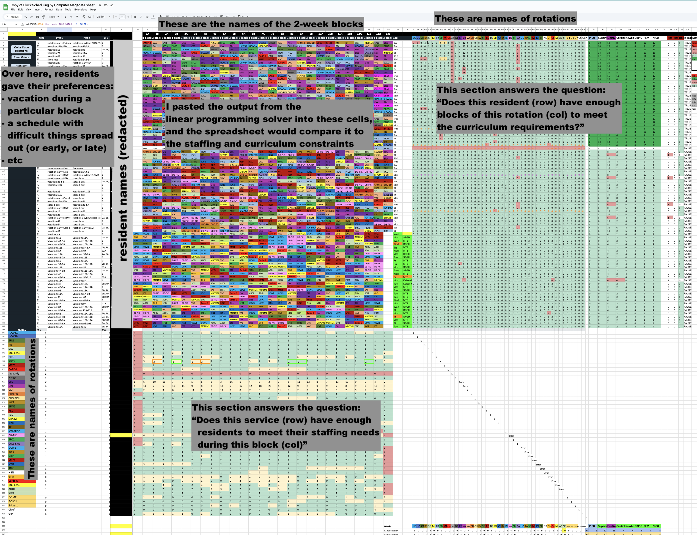
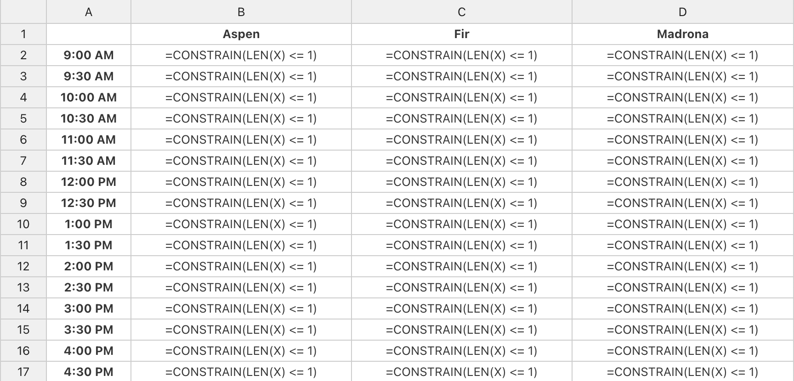

Constraint optimization tools are underused. As far as I can tell, they're used in niche applications like shipping logistics, but not for everyday tasks like seating arrangements for a party. They're a powerful tool, but definitely hard to use.

I found a couple of examples of people applying constraint optimization to everyday problems:

- [Wedding seating arrangements](https://blogs.sas.com/content/operations/2014/11/10/do-you-have-an-uncle-louie-optimal-wedding-seat-assignments/) (many examples like this)
- [Scheduling rowing outings](https://www.danielhugenroth.com/posts/2022_03_glpk_tutorial/)
- [Scheduling operating rooms](https://towardsdatascience.com/schedule-optimisation-using-linear-programming-in-python-9b3e1bc241e1)

I've written about a couple of others:

- [Scheduling conference talks to avoid conflicts](../../../2024/11/07/scheduling-conference-talks-lp.md)
- [Scheduling medical rotations in a residency](../../../2019/01/26/residency-scheduling.md)

How would a non-programmer approach these problems? Imagine you're making a shift schedule for a local cafe. It seems unlikely that you would reach for a constraint solver. You're probably going to work it out by hand, or use Excel (but only as a grid—not for computation).

This seems like a missed opportunity. Isn't this what computers are supposed to be for? To help us with tedious tasks like this? [Here's a reddit post](https://www.reddit.com/r/learnprogramming/comments/161lkex/complicated_linear_programmingsolver_type/) from someone trying to solve this problem for 7 employees and 5 shifts and they say, "we do the schedule by hand, and it's excruciating."

Ink & Switch wrote about this in their post, [Untangle: solving problems with fuzzy constraints](https://www.inkandswitch.com/untangle/). They describe a tool that allows hand drawing on a table, creating constraints with something they call "visual queries". It's a great post! The strangeloop presentation has a great demo. However, I'm interested in problems that might be a little larger in scope—big enough to warrant a spreadsheet.

## Formulating the problems as linear programs

For all of the problems above, we'd like to assign elements from one set to another.

- In the wedding seating problem, we want to assign guests to tables.
- In the conference talk scheduling problem, we want to assign talks to `(venues X time_slots)`—the Cartesian product of venues and time slots.
- In the residency scheduling problem, we want to assign residents to `(rotations X time_slots)`.
- In the rowing outing problem, we want to assign rowers to outings.

In order to formulate these problems as linear programs, we can define indicator variables. For example, in the rowing problem the author defines `x[i,j] = 1 means rower i is assigned to outing j`.

This seems general enough to tackle a wide variety of problems, though it's less expressive than linear programs in general. We should be able to hide this implementation detail from end-users.

## Aside: UCSF Medical Residency Scheduling

After I wrote my first post on scheduling medical rotations in a residency, I got an email from the chief resident at the pediatrics residency at UCSF. They were working on the same problem, but for around 70 residents (I originally wrote about a residency with 12 people). They hired me to work on the problem with them.

Things mostly progressed pretty well. I was stuck for a little while because `cbc`—the open-source solver that is pulp's default—was too slow to tackle the problem. I switched to CPLEX and made more progress.

A bigger issue was in clarifying rules. I kept finding that the problem was infeasible—had no solution under the constraints. Sometimes that was a bug in my code, but often it was because the residency program had asked me to implement rules as hard constraints that were actually best effort. For example, a rule might have said "only third year residents may staff the NICU", but there aren't enough third year residents to staff it in light of their other curricular needs. Bringing this back to the program, they might clarify that second year-residents who were at least 8 months into their second year could fill in if needed.

This back-and-forth characterized much of the project, and lead to it's taking much longer than I'd anticipated. I came to think of myself as a middleman between the residency program and the linear program. Much better would be if the program coordinator could write the rules themselves and get interactive feedback when a constraint couldn't be satisfied.

In order to speed up the turn-around, the chief resident put together a very complicated google sheet that could check a proposed schedule for many of the rules. In the main part of the spreadsheet, I could paste the output from my python program. The spreadsheet would color-code it, and use it to calculate two sections of sanity checks. The first sanity checks were about staffing needs. They added up the number of residents assigned to each of the services and compared it to the number of residents needed. The second sanity checks were about curriculum requirements. They added up the number of two-week blocks of each rotation and ensured that each resident had the right number of each type of rotation.



This got me thinking: can we move the whole process into a spreadsheet? Can we create a tool that allows users to specify constraints in a spreadsheet and then solve them?

## Spreadsheet-based constraint solving

Spreadsheets are the most powerful end-user programming tool in the world. Nearly everyone who would be helped by a tool like this is already using a spreadsheet for it (though the spreadsheet isn't helping them solve the problem). What is good about spreadsheets that we can leverage for this problem?

### Co-located data and rules

Traditional software abstracts over the data, storing it separately in a file or database or API. Only the computation is described in the code. Spreadsheets, on the other hand, have the data and the computation in the same place. I suspect this is more intuitive for people, as they're familiar with the data—those are the names of people or rooms or shifts or something from the domain.

Laying out the data also offers a tidy way to locate the rules. I'll show an example using the [conference talk scheduling problem](/blog/2024/11/07/scheduling-conference-talks-lp) I wrote about last week. Here's a portion of the "talks" table from that problem:

| Title                                                                            | Duration |
| -------------------------------------------------------------------------------- | -------- |
| Beyond Syntax: Designing Languages for Human Cognition                           | 20m      |
| From Models to Applications: Practical AI for the Everyday Developer             | 20m      |
| Ethical AI: Balancing Innovation with Responsibility in Machine Learning Systems | 50m      |
| Transformers Unleashed: Revolutionizing NLP Beyond Text                          | 50m      |
| Rethinking State Management: Beyond Redux in Modern Web Apps                     | 50m      |
| WebAssembly: Unlocking Native Performance in the Browser                         | 20m      |

One rule we want to apply is that each talk should be scheduled exactly once. In a spreadsheet there's a natural place to put this rule: in a column to the right of the table.

How might this look? Thinking about the indicator variables from [above](#formulating-the-problem-as-a-linear-program), we want each row to be associated with the set of indicator variables that are "on" for that row's value. For the talks table, imagine there's a magic variable `X` that consists of a set of all `(venue, time_slot)` pairs associated with each talk. So for the "Beyond Syntax" talk, if `X` is `{(Madrona, 9:30), (Madrona, 10:00), (Fir, 12:00)}`, we understand that the talk is scheduled in the Madrona conference room at 9:30 and 10:00, and in Fir at 12:00.

Let's think about constraints as constraining the value of this `X` variable, and try to write a rule that says, "each talk is scheduled exactly once". We can write this as a formula (with made-up functions `CONSTRAIN_EQUAL` and `LENGTH`) in a cell to the right of the table:

```scala
=CONSTRAIN(LENGTH(X) == 1)
```

That defines a constraint for one talk. To apply it to every talk, we can copy-paste the formula down the column. This is how we can accomplish looping in spreadsheets!

Some of the talks are 50 minutes long, so they actually need two consecutive time slots. Leaving aside the 'consecutive' part, let's adjust the formula to allow for this:

```scala
=CONSTRAIN(LENGTH(X) == IF(EQUAL(RC[-1], "20m", 1, 2)))
```

This uses the `RC` notation to refer to the cell in the same row and one column to the left. The `IF` function checks the duration of the talk and sets the constraint to 1 if it's 20 minutes and 2 if it's 50 minutes.

| Title                                                                            | Duration | Schedule for one time slot (two for 50m talks)           |
| -------------------------------------------------------------------------------- | -------- | -------------------------------------------------------- |
| Beyond Syntax: Designing Languages for Human Cognition                           | 20m      | `=CONSTRAIN(LENGTH(X) == IF(EQUAL(RC[-1], "20m", 1, 2))` |
| From Models to Applications: Practical AI for the Everyday Developer             | 20m      | `=CONSTRAIN(LENGTH(X) == IF(EQUAL(RC[-1], "20m", 1, 2))` |
| Ethical AI: Balancing Innovation with Responsibility in Machine Learning Systems | 50m      | `=CONSTRAIN(LENGTH(X) == IF(EQUAL(RC[-1], "20m", 1, 2))` |
| Transformers Unleashed: Revolutionizing NLP Beyond Text                          | 50m      | `=CONSTRAIN(LENGTH(X) == IF(EQUAL(RC[-1], "20m", 1, 2))` |
| Rethinking State Management: Beyond Redux in Modern Web Apps                     | 50m      | `=CONSTRAIN(LENGTH(X) == IF(EQUAL(RC[-1], "20m", 1, 2))` |
| WebAssembly: Unlocking Native Performance in the Browser                         | 20m      | `=CONSTRAIN(LENGTH(X) == IF(EQUAL(RC[-1], "20m", 1, 2))` |

#### Constraints on the combination of two tables

Most of the constraints make sense at the intersection of two tables. For example, we might want to make sure that no two talks are scheduled in the same room at the same time. For that, we'd need to create a view reflecting the cross-product of venues and time slots.

|         | Aspen | Fir | Madrona |
| ------- | ----- | --- | ------- |
| 9:00am  |       |     |         |
| 9:30am  |       |     |         |
| 10:00am |       |     |         |
| ...     |       |     |         |

Given this view, we can write a simple formula that looks at the `X` variables for each talk:

```scala
=CONSTRAIN(LENGTH(X) <= 1)
```

Copy-pasting this across the grid will enforce that venue is double-booked for any time slot.



#### Revisiting the consecutive time slots constraint

Now that we've explored constraints on the combination of two tables, we can revisit the "50 minute talks need two consecutive time slots" constraint. We can write a formula that creates a constraint relating a pair of time slots.

We'd like to say something like

> If the talk is 50 minutes, then one of the following must be true:
>
> - The talk is scheduled for this time slot and the next time slot
> - The talk is scheduled for this time slot and the previous, or
> - The talk is _not_ scheduled for this time slot

Imagine we have the following table:

| Title                                                                            | Duration | 9:00am | 9:30am | 10:00am | 10:30am | 11:00am | .... |
| -------------------------------------------------------------------------------- | -------- | ------ | ------ | ------- | ------- | ------- | ---- |
| Beyond Syntax: Designing Languages for Human Cognition                           | 20m      |
| From Models to Applications: Practical AI for the Everyday Developer             | 20m      |
| Ethical AI: Balancing Innovation with Responsibility in Machine Learning Systems | 50m      |
| Transformers Unleashed: Revolutionizing NLP Beyond Text                          | 50m      |
| Rethinking State Management: Beyond Redux in Modern Web Apps                     | 50m      |
| WebAssembly: Unlocking Native Performance in the Browser                         | 20m      |

Let's try and build each part of that formula, as it would appear in the 9:30am cell for the "Beyond Syntax" talk (we'll leave the 9am column blank because it doesn't have a previous time slot, so the pattern breaks).

"If the talk is 50 minutes" can be written as `=IF(EQUAL($B2, "50m"), ..something..)`. Here, we use `$B` to always refer to the duration column, rather than implying "the column a couple to the left"

"The talk is scheduled for this timeslot and the next" is written `EQUAL(X, RC[1])`, and "the talk is scheduled for this timeslot and the previous" is `EQUAL(X, RC[-1])`. We can combine these with an `OR` function.

Finally, "the talk is not scheduled for this time slot" is `EQUAL(LENGTH(X), 0)`. That is, there are no (talk, venue, timeslot) triples where the talk is "Beyond Syntax" and the timeslot is "9:30am". Putting this all together, we'd have:

```scala
=IF(EQUAL($B2, "50m"), // Only consider 50m talks
  CONSTRAIN(OR( // one of the following must be true
    EQUAL(X, RC[1]), // the talk is scheduled for this time slot and the next
    EQUAL(X, RC[-1]), // the talk is scheduled for this time slot and the previous
    EQUAL(LENGTH(X), 0) // the talk is not scheduled for this time slot
)))
```

Copying this formula across the grid will enforce the constraint that 50 minute talks are scheduled in consecutive time slots. We're okay skipping the 9am column and the last column because the column just next door will cover it.

## Digging into the formula language

- magic `X` variable
- comparison operators: `==`, `<=`, `>=`
- index-match-match is horrendous—can we do a better job of looking up an attribute of a row?
- Can we use a different language inside the `CONSTRAIN(...)`? How else to accomplish introducing the magic `X` variable?
