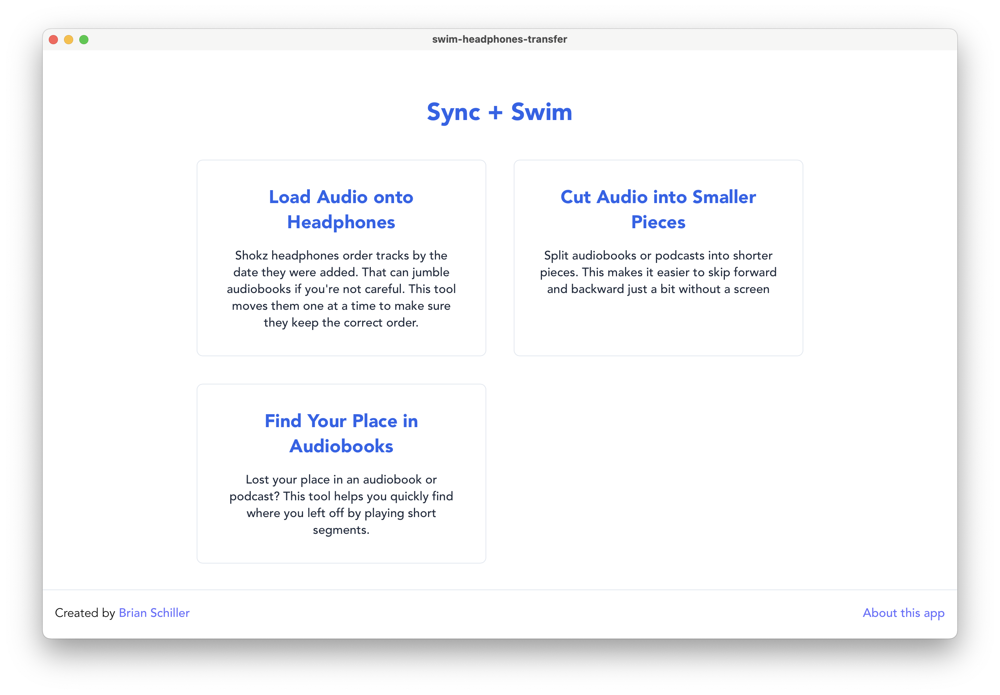
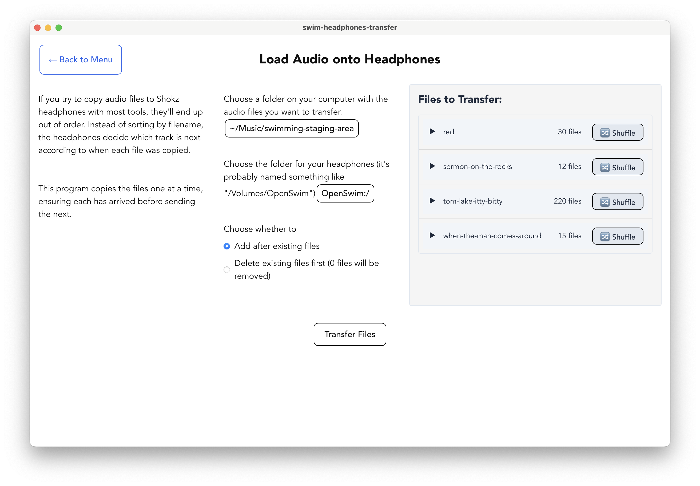
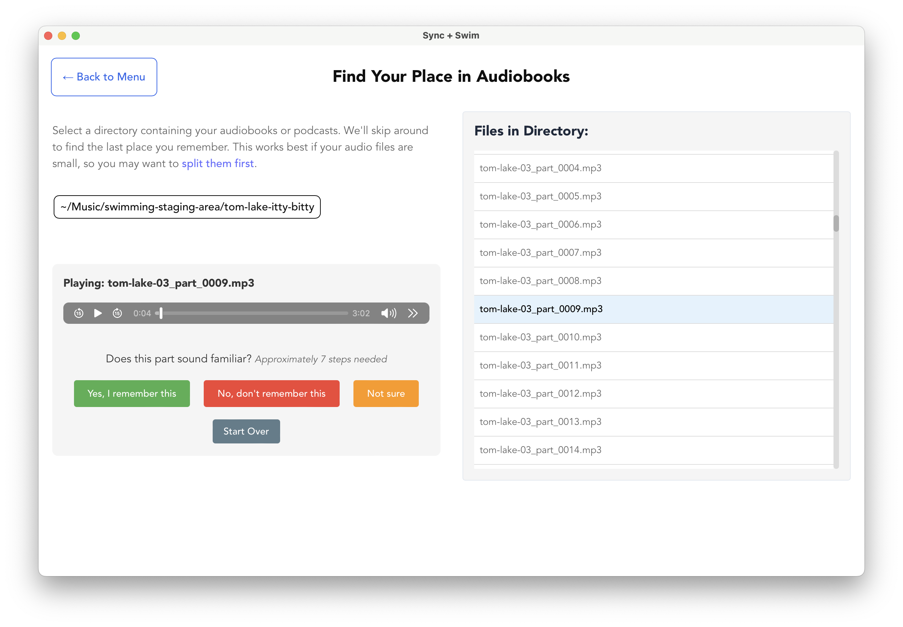

About a year ago, I [wrote about the bash scripts I'd cobbled together so I could load music and audiobooks onto my Shokz OpenSwim headphones](/blog/2023/12/13/swimming-audiobooks/). They worked great, but they didn't feel accessible to a non-programmer. I wanted to make something that anyone could use.

I mocked up a UI in Excalidraw and started building the app with Tauri.

I'm happy with the result. This was also an experiment using [aider](https://aider.chat/), an AI tool. There were a number of times I needed to step in and code something by hand, and the CSS is a bit of a mess. But I'm not sure I would have shipped something without it. It did a passable-to-mediocre job at the parts I wasn't interested in (like making the UI look good) and let me focus on the parts I was excited about.

You can see the code and download the app at [github.com/bgschiller/sync-and-swim](https://github.com/bgschiller/sync-and-swim).

## How to use the app

There are three functions offered by the app:

1. **Load music** - Add music files to the headphones. The files are copied to the headphones, taking care that the file system timestamps match the alphabetical order of the files. This is important because the headphones play the files in the order of the timestamps.
2. **Cut audio files** - Cut audio files to a specific length. This is useful for cutting audiobooks into smaller parts that are easier to listen to during a swim. Otherwise, you may miss a part of the book and be unable to rewind by just a bit.
3. **Find your place** - Find your place in an audiobook. Sometimes the headphones turn on in your bag and you lose your spot. This feature helps you find your place in the book, then delete the files you've already listened to.

### Load music

I find it useful to keep a folder on my laptop called "swimming-staging-area". I fill this folder with the music and audiobooks that I'll want to transfer. I can rename the folders so they show up in the order I want.

Each folder can be individually shuffled or sorted by name. The headphones also have a shuffle feature, but it's not one of the button combinations I've memorized, so this was easier for me. In this case, the shuffling happens once, at the time of transfer. Subsequent plays of the same folder will be in the same shuffled order.

You can optionally have the app delete the files from the destination before copying the new ones over. The default is to leave existing files in place, adding the new ones after any that were already there.

### Cut audio files

With only three buttons and no screen, there's no function on the OpenSwim headphones to skip back a few seconds. This can be frustrating when you're listening to an audiobook and you miss a bit.

This function of the app allows you to cut audio files into smaller pieces. There's a slight stutter when the headphones switch from one file to the next, but the app will try to identify silent points in the audio and cut there.

> Note: This function requires that [ffmpeg](https://www.ffmpeg.org/download.html) is installed and available on your PATH. You'll see an error message if it can't be found.

### Find your place

It's hard to know how far along you are in an audiobook on a device with no screen. If you lose your spot, you can use this tool to find where you left off. It proposes a sequence of files to listen to, and you click either "Yes, I remember this", "No, I don't remember this", or "Not sure". The app performs a binary search to find the right spot.

Once you've found the earliest-not-yet-completed file, you can optionally delete the earlier tracks.

This works best on audiobooks that are split into smaller pieces (with the "Cut audio files" function). If you have a handful of long files, the best this will do is find the right one.
