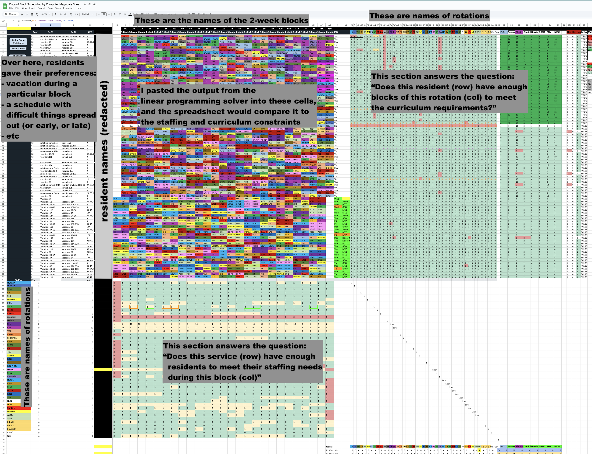
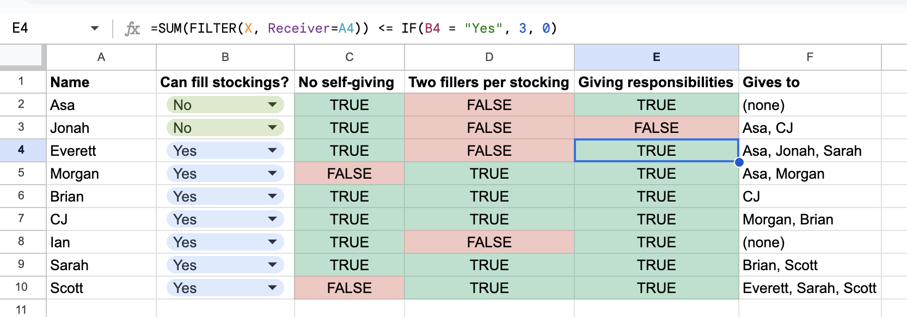
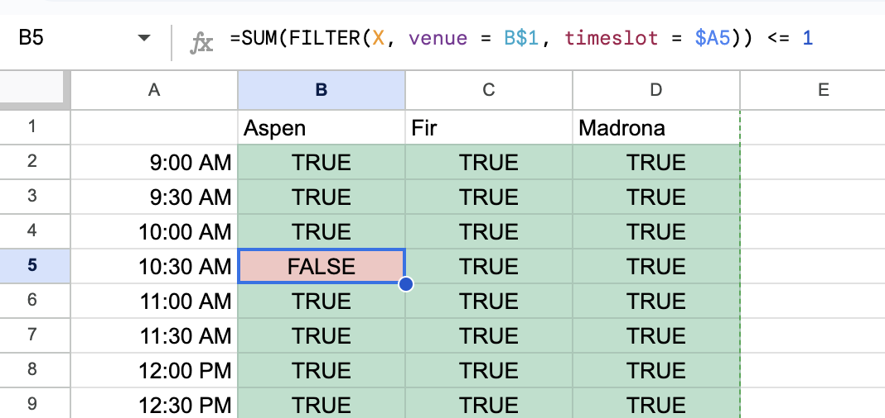
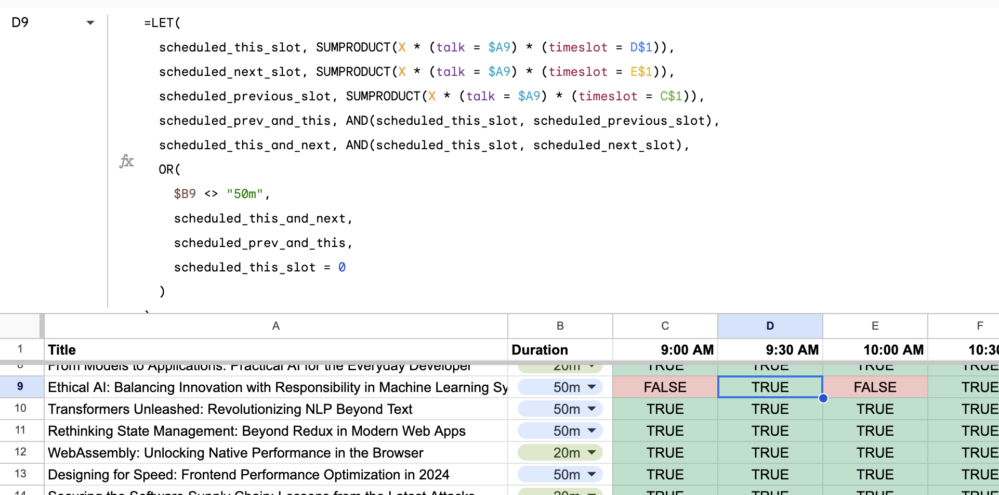
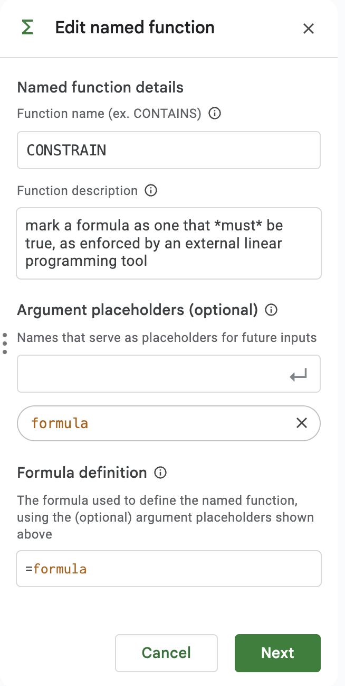

Constraint optimization tools are underused. As far as I can tell, they're used in niche applications like shipping logistics, but not for everyday tasks like seating arrangements for a party. They're a powerful tool, but hard to use.

I found a couple of examples of people applying constraint optimization to everyday problems:

- [Wedding seating arrangements](https://blogs.sas.com/content/operations/2014/11/10/do-you-have-an-uncle-louie-optimal-wedding-seat-assignments/) (many examples like this)
- [Scheduling rowing outings](https://www.danielhugenroth.com/posts/2022_03_glpk_tutorial/)
- [Scheduling operating rooms](https://towardsdatascience.com/schedule-optimisation-using-linear-programming-in-python-9b3e1bc241e1)

I've written about a couple of others:

- [Scheduling conference talks to avoid conflicts](../../../2024/11/07/scheduling-conference-talks-lp.md)
- [Scheduling medical rotations in a residency](../../../2019/01/26/residency-scheduling.md)

How would a non-programmer approach these problems? Imagine you're making a shift schedule for a local cafe. It seems unlikely that you would reach for a constraint solver. You're probably going to work it out by hand, or use Excel (but only as a grid—not for computation).

This seems like a missed opportunity. Isn't this what computers are supposed to be for? To help us with tedious tasks like this? [Here's a reddit post](https://www.reddit.com/r/learnprogramming/comments/161lkex/complicated_linear_programmingsolver_type/) from someone trying to solve this problem for 7 employees and 5 shifts and they say, "we do the schedule by hand, and it's excruciating."

Ink & Switch wrote about this in their post, [Untangle: solving problems with fuzzy constraints](https://www.inkandswitch.com/untangle/). They describe a tool that allows hand drawing on a table, creating constraints with something they call "visual queries". It's a great post! The Strangeloop presentation has a great demo. However, I'm interested in problems that might be a little larger in scope—big enough to warrant a spreadsheet.

## Formulating the problems as linear programs

For all of the problems above, we'd like to assign elements from one set to another.

- In the wedding seating problem, we want to assign guests to tables.
- In the conference talk scheduling problem, we want to assign talks to `(venues X time_slots)`—the Cartesian product of venues and time slots.
- In the residency scheduling problem, we want to assign residents to `(rotations X time_slots)`.
- In the rowing outing problem, we want to assign rowers to outings.

In order to formulate these problems as linear programs, we can define indicator variables. For example, in the rowing problem the author defines `x[i,j] = 1 means rower i is assigned to outing j`.

This seems general enough to tackle a wide variety of problems, though it's less expressive than linear programs in general. We should be able to hide this implementation detail from end-users.

## Visualizing the solution

Let's use the rowing outing problem as an example. If we wanted to solve this by hand, we might start by laying out a grid of rowing positions and outing days, then start writing names into place.

|        | Mon | Tue | Wed | Thu |
| :----: | :-: | :-: | :-: | :-: |
| Coach  |     |     |     |     |
|  Cox   |     |     |     |     |
|  Bow   |     |     |     |     |
| Stroke |     |     |     |     |

You might have some erasing to do as you go along. Maybe Steven can't make it to Tuesday, and would prefer not to row on two consecutive days. You might pencil him in for Monday and Wednesday, making a note that you could move him from Wednesday to Thursday if you needed.

|        |  Mon   | Tue |           Wed           | Thu |
| :----: | :----: | :-: | :---------------------: | :-: |
| Coach  |        |     |                         |     |
|  Cox   |        |     |                         |     |
|  Bow   | Steven |     | Steven (or move to Thu) |     |
| Stroke |        |     |                         |     |

You might also add a note showing who is available for each of the positions.

|        |  Mon   | Tue |           Wed           | Thu |                       who?                        |
| :----: | :----: | :-: | :---------------------: | :-: | :-----------------------------------------------: |
| Coach  |        |     |                         |     |                 Stacy<br>Donovan                  |
|  Cox   |        |     |                         |     |                  Grace<br>Quinn                   |
|  Bow   | Steven |     | Steven (or move to Thu) |     | Jack<br>Karen<br>Liam<br>Ethan<br>Carla<br>Steven |
| Stroke |        |     |                         |     |  Noah<br>Peter<br>Mia<br>Aisha<br>Carlos<br>Jack  |

You could go on adding notes like this, trying to make sure that everyone is happy with the schedule like you're solving a Sudoku puzzle. But what if you could make those notes into computable rules? The computer could propose solutions, and you could tweak them and see updated proposals in response.

The idea I have is that every cell can accept some combination of

- a value (like a name, or a list of names)
- a formula that constrains the value. For example,
  - "if the cell to the left contains 'Steven', this cell may not", or
  - "each name may appear at most once in a column—no one can row two positions on the same outing")
- A formula that expresses a preference. For example,
  - "Jack prefers to row Bow, but is willing to row Stroke" _I don't know anything about rowing, is this reasonable?_
  - Kathleen would like to take vacation during the first week of July
- A computer-proposed value consistent with the constraints

## Aside: UCSF Medical Residency Scheduling

After I wrote my first post on scheduling medical rotations in a residency, I got an email from the chief resident at the pediatrics residency at UCSF. They were working on the same problem, but for around 70 residents (I originally wrote about a residency with 12 people). They hired me to work on the problem with them.

Things mostly progressed pretty well. I was stuck for a little while because `cbc`—the open-source solver that is pulp's default—was too slow to tackle the problem. I switched to CPLEX and made more progress.

A bigger issue was in clarifying rules. I kept finding that the problem was infeasible—had no solution under the constraints. Sometimes that was a bug in my code, but often it was because the residency program had asked me to implement rules as hard constraints that were actually best effort. For example, a rule might have said "only third year residents may staff the NICU", but there aren't enough third year residents to staff it in light of their other curricular needs. Bringing this back to the program, they might clarify that second year-residents who were at least 8 months into their second year could fill in if needed.

This back-and-forth characterized much of the project, and lead to its taking much longer than I'd anticipated. I came to think of myself as a middleman between the residency program and the linear program. Much better would be if the program coordinator could write the rules themselves and get interactive feedback when a constraint couldn't be satisfied.

In order to speed up the turn-around, the chief resident put together a very complicated google sheet that could check a proposed schedule for many of the rules. In the main part of the spreadsheet, I could paste the output from my python program. The spreadsheet would color-code it, and use it to calculate two sections of sanity checks. The first sanity checks were about staffing needs. They added up the number of residents assigned to each of the services and compared it to the number of residents needed. The second sanity checks were about curriculum requirements. They added up the number of two-week blocks of each rotation and ensured that each resident had the right number of each type of rotation.



This got me thinking: can we move the whole process into a spreadsheet? Can we create a tool that allows users to specify constraints in a spreadsheet and then solve them?

## Spreadsheet example: Stocking Assignments

Let's say there's a family organizing Christmas stocking gifts with the following rules:

- Each person should have a stocking with their name on it.
- No one fills their own stocking.
- Each person's stocking should have two people assigned to fill it.
- Jonah and Asa are too young to fill stockings, so they shouldn't be assigned to fill any.
- Otherwise, each person should be assigned to fill an equal number of stockings, or as close as possible.

We should be able to define this using just one data table. Let's start with a table of people.

| Name    | Can fill stockings? |
| ------- | ------------------- |
| Asa     | No, too young       |
| Jonah   | No, too young       |
| Everett | Yes                 |
| Morgan  | Yes                 |
| Brian   | Yes                 |
| CJ      | Yes                 |
| Ian     | Yes                 |
| Sarah   | Yes                 |
| Scott   | Yes                 |

It seems like we should be able to just add formulas saying "who fills their stocking" or maybe "whose stockings they fill", but I couldn't come up with a way to make that work. Some rules work better using one view of the data, and some work better using another. But there's not an easy way to link the two perspectives using a single table. Instead, we need to introduce a new table that represents the possible combinations of givers and receivers.

| Giver | Receiver | X   |
| ----- | -------- | --- |
| Asa   | Asa      |     |
| Asa   | Jonah    |     |
| Asa   | ...      |
| Jonah | Asa      |     |
| Jonah | ...      |     |
| ...   | ...      |
| Scott | Scott    |

The table above displays exactly the indicator variables involved in our model. When the `X` column has a 1 in a row, we're saying that the person in the "Giver" column is assigned to fill the stocking of the person in the "Receiver" column. Assuming we create named ranges for `Giver`, `Receiver`, and `X`, we can write formulas to enforce the rules above.

### No one fills their own stocking

One option would be to mark zeroes in the X column wherever the Giver and Receiver values match. That says, "Asa doesn't give to Asa", "Jonah doesn't give to Jonah", ..., "Scott doesn't give to Scott". With this number of people, it's not too bad to fill by hand. But in a larger group it would be nice to be able to copy-paste a single formula.

Back on the original table, we can add a column that says "No self giving" and fill it with the following formula:

```scala
=FILTER(X, Giver = A2, Receiver = A2) = 0
```

In that formula, `A2` refers to the value in the Name column for that row. When we copy-paste the formula, the `A2` will change to `A3`, `A4`, etc.

### Two fillers per stocking

We can enforce that each stocking has two fillers by summing the rows. We can add a column to the right labelled "Two Fillers" and write:

```scala
=SUM(FILTER(X, Receiver = A2)) = 2
```

This says, "Adding the indicator values from X where the Receiver is the person in the Name column for this row should add up to 2". Copy-pasting this formula down the column will enforce that each stocking has two fillers.

### Stocking fill responsibilities

Let's phrase the stocking filling responsibilities as "Each person should fill no more than **s** stockings." For Asa and Jonah, this will be zero. For everyone else, it will be 3. We'll use `B2` to represent the "Can fill stockings?" column.

```scala
=SUM(FILTER(X, Giver=A2)) <= IF(B2 = "Yes", 3, 0)
```

This balances the number of stockings each person fills, allowing for the fact that someone needs to step in and cover for Asa and Jonah.

### Displaying the results

Let's define another column, "Gives to" that contains the set of people that each person gives to.

```scala
=JOIN(", ", FILTER(Receiver, Giver = A2, X = 1))
```

This is the first formula we're using that filters on something other than `X`. We're saying "Find the values of the Receiver column where the Giver is matches this row and the X value is 1". We `JOIN(", ")` to keep the multiple values all in one cell.

This will give some errors for Asa and Jonah, as the FILTER will return an empty set. It's fine to leave them as errors, or we can use `IFERROR` to clean it up a bit.

```scala
=IFERROR(JOIN(", ", FILTER(Receiver, Giver = A2, X = 1)), "(none)")
```



### Getting the computer to generate the solution

We're really like to have the computer generate a solution, or guide us to which constraints conflict with one another. How can we translate these formulas into constraints that an optimization solver can understand?

## Spreadsheet-based constraint solving

Spreadsheets are the most powerful end-user programming tool in the world. Nearly everyone who would be helped by a tool like this is already using a spreadsheet for it (though the spreadsheet isn't helping them solve the problem). What is good about spreadsheets that we can leverage for this problem?

### Co-located data and rules

Traditional software abstracts over the data, storing it separately in a file or database or API. Only the computation is described in the code. Spreadsheets, on the other hand, have the data and the computation in the same place. I suspect this is more intuitive for people, as they're familiar with the data—those are the names of people or rooms or shifts: something from the domain.

Laying out the data also offers a tidy way to locate the rules. I'll show an example using the [conference talk scheduling problem](/blog/2024/11/07/scheduling-conference-talks-lp) I wrote about last week. Here's a portion of the "talks" table from that problem:

| Title                                                                            | Duration |
| -------------------------------------------------------------------------------- | -------- |
| Beyond Syntax: Designing Languages for Human Cognition                           | 20m      |
| From Models to Applications: Practical AI for the Everyday Developer             | 20m      |
| Ethical AI: Balancing Innovation with Responsibility in Machine Learning Systems | 50m      |
| Transformers Unleashed: Revolutionizing NLP Beyond Text                          | 50m      |
| Rethinking State Management: Beyond Redux in Modern Web Apps                     | 50m      |
| WebAssembly: Unlocking Native Performance in the Browser                         | 20m      |

One rule we want to apply is that each talk should be scheduled exactly once. In a spreadsheet there's a natural place to put this rule: in a column to the right of the table.

How might this look? Thinking about the indicator variables from [above](#formulating-the-problems-as-linear-programs), we want each row to be associated with the set of indicator variables that are "on" for that row's value. Let's create a sheet in the workbook holding the indicator variables. It will have columns for `talk`, `venue`, `time_slot`, and `X`. There will be a row for each possible combination of talk, venue, and time slot, with the value in the `X` column either 0 or 1 to indicate whether that talk is scheduled for that venue at that time_slot. Assume we have named ranges for the columns `talk`, `venue`, `time_slot`, and `X`, just like we did for the stockings problem.

Let's make up a function `CONSTRAIN` that marks a formula for the constraint solver to pay attention to. For example, we might write:

```scala
=CONSTRAIN(SUM(FILTER(X, talk = A2)) = 1)
```

We're using `SUM` because the values in the `X` column are always 1s or 0s, so adding them is equivalent to counting the ones that are set. That defines a constraint for one talk. To apply it to every talk, we can copy-paste the formula down the column. This is how we can accomplish looping in spreadsheets!

Some of the talks are 50 minutes long, so they actually need two consecutive time slots. Leaving aside the 'consecutive' part, let's adjust the formula to allow for this:

```scala
=CONSTRAIN(SUM(FILTER(X, talk = A2)) = IF(B2 = "20m", 1, 2))
```

The `IF` function checks the duration of the talk and sets the constraint to 1 if it's 20 minutes and 2 if it's 50 minutes.

| Title                                                                            | Duration | Schedule for one time slot (two for 50m talks)                |
| -------------------------------------------------------------------------------- | -------- | ------------------------------------------------------------- |
| Beyond Syntax: Designing Languages for Human Cognition                           | 20m      | `=CONSTRAIN(SUM(FILTER(X, talk = A2)) = IF(B2 = "20m", 1, 2)` |
| From Models to Applications: Practical AI for the Everyday Developer             | 20m      | `=CONSTRAIN(SUM(FILTER(X, talk = A3)) = IF(B3 = "20m", 1, 2)` |
| Ethical AI: Balancing Innovation with Responsibility in Machine Learning Systems | 50m      | `=CONSTRAIN(SUM(FILTER(X, talk = A4)) = IF(B4 = "20m", 1, 2)` |
| Transformers Unleashed: Revolutionizing NLP Beyond Text                          | 50m      | `=CONSTRAIN(SUM(FILTER(X, talk = A5)) = IF(B5 = "20m", 1, 2)` |
| Rethinking State Management: Beyond Redux in Modern Web Apps                     | 50m      | `=CONSTRAIN(SUM(FILTER(X, talk = A6)) = IF(B6 = "20m", 1, 2)` |
| WebAssembly: Unlocking Native Performance in the Browser                         | 20m      | `=CONSTRAIN(SUM(FILTER(X, talk = A7)) = IF(B7 = "20m", 1, 2)` |

#### Constraints on the combination of two tables

Most of the constraints make sense at the intersection of two tables. For example, we might want to make sure that no two talks are scheduled in the same room at the same time. For that, we'd need to create a view reflecting the cross-product of venues and time slots.

|         | Aspen | Fir | Madrona |
| ------- | ----- | --- | ------- |
| 9:00am  |       |     |         |
| 9:30am  |       |     |         |
| 10:00am |       |     |         |
| ...     |       |     |         |

Given this view, we can write a simple formula that looks at the `X` variables for each talk. The value in the Aspen column at 9:00am might be

```scala
=CONSTRAIN(SUM(FILTER(X, venue = B$1, time_slot = $A2)) <= 1)
```

We're using `$` to create absolute references to the column for the venue and the row for the time slot as we copy-paste the formula across the grid. Otherwise, the formula would refer to "the cell above me" and "the cell immediately to the left", which would be a problem when we copied it to the second row or column.

Copy-pasting this across the grid will enforce that no venue is double-booked for any time slot. In the screenshot below, I've put a 1 in the ("Beyond Syntax", "Aspen", "10:30am") and ("Compiling to the Future", "Aspen", "10:30am") cells to show that the formula is working. Those talks are in the same room at the same time, so we should see `FALSE` because the sum of the two entries in the `X` table is 2.



#### Revisiting the consecutive time slots constraint

Now that we've explored constraints on the combination of two tables, we can revisit the "50 minute talks need two consecutive time slots" constraint. We can write a formula that creates a constraint relating a pair of time slots.

We'd like to say something like

> If the talk is 50 minutes, then one of the following must be true:
>
> - The talk is scheduled for this time slot and the next time slot
> - The talk is scheduled for this time slot and the previous, or
> - The talk is _not_ scheduled for this time slot

Imagine we have the following table:

| Title                                                                            | Duration | 9:00am | 9:30am | 10:00am | 10:30am | 11:00am | .... |
| -------------------------------------------------------------------------------- | -------- | ------ | ------ | ------- | ------- | ------- | ---- |
| Beyond Syntax: Designing Languages for Human Cognition                           | 20m      |
| From Models to Applications: Practical AI for the Everyday Developer             | 20m      |
| Ethical AI: Balancing Innovation with Responsibility in Machine Learning Systems | 50m      |
| Transformers Unleashed: Revolutionizing NLP Beyond Text                          | 50m      |
| Rethinking State Management: Beyond Redux in Modern Web Apps                     | 50m      |
| WebAssembly: Unlocking Native Performance in the Browser                         | 20m      |

Let's try and build each part of that formula, as it would appear in the 9:30am cell for the "Beyond Syntax" talk (we'll leave the 9am column blank because it doesn't have a previous time slot, so the pattern breaks).

"If the talk is 50 minutes" can be written as `=IF($B2 = "50m", ..something..)`. Here, we use `$B` to always refer to the duration column, rather than implying "the column a couple to the left". Alternatively, we could say `=OR($B2 <> "50m", ..something..)`, which will be a little more convenient in the full formula. We'll be `OR`ing several conditions together, so this will read a little nicer. We use this construction in English sometimes: "If we don't put our pants on, we're not going to the park" has the same meaning as "We need to put our pants on or we're not going to the park".

We need to get a little creative with the next part, "The talk is scheduled for this timeslot and the next". Initially, I tried to write `SUM(FILTER(X, talk = $A2, timeslot = C$1, X))` to mean "true/false: the talk titled by `A2` is scheduled for timeslot in `C$1`". The problem is that the `FILTER` function throws an error if it doesn't find any matching rows (like when the talk _isn't_ scheduled then). `SUM( an error )` is still an error, so we have to find a different way.

I got some help from [Al Chen](https://alchen2.medium.com/) to put together a formula that works. We need to use `SUMPRODUCT`, it seems. The formula `SUMPRODUCT((talk = $A2) * (timeslot = C$1) * X)` will give us the sum of values where all three clauses are true. Multiplying booleans is like `AND`ing them. If any is false, the product is false.

"The talk is scheduled for this timeslot and the next" is written

```scala
=AND(
  SUMPRODUCT(X * (talk = $A2) * (timeslot = C$1)) = 1,
  SUMPRODUCT(X * (talk = $A2) * (timeslot = D$1)) = 1
)
```

"The talk is scheduled for this timeslot and the previous" is similar, with the cell references changed a bit.

Finally, "the talk is not scheduled for this time slot" is `SUMPRODUCT(X * (talk = $A2) * (timeslot = C$1)) = 0`. That is, all the rows in the indicator variables table where the talk is "Beyond Syntax" and the timeslot is "9:00am" are set to zero. Putting this all together, we'd have:

```scala
=OR( // one of the following must be true
  $B2 <> "50m", // This isn't a 50min talk, so don't worry about the rest
  AND(
    SUMPRODUCT(X * (talk = $A2) * (timeslot = C$1)) = 1, // talk is scheduled for this timeslot
    SUMPRODUCT(X * (talk = $A2) * (timeslot = D$1)) = 1 // talk is scheduled for the next timeslot
  ),
  AND(
    SUMPRODUCT(X * (talk = $A2) * (timeslot = C$1)) = 1, // talk is scheduled for this timeslot
    SUMPRODUCT(X * (talk = $A2) * (timeslot = B$1)) = 1 // talk is scheduled for the previous timeslot
  ),
  SUMPRODUCT(X * (talk = $A2) * (timeslot = C$1)) = 0 // the talk is not scheduled for this time slot
)
```

We can clean this up using `LET` to make it more readable

```scala
=LET(
  scheduled_this_slot, SUMPRODUCT(X * (talk = $A2) * (timeslot = C$1)),
  scheduled_next_slot, SUMPRODUCT(X * (talk = $A2) * (timeslot = D$1)),
  scheduled_previous_slot, SUMPRODUCT(X * (talk = $A2) * (timeslot = B$1)),
  scheduled_prev_and_this, AND(scheduled_this_slot, scheduled_previous_slot),
  scheduled_this_and_next, AND(scheduled_this_slot, scheduled_next_slot),
  OR(
    $B2 <> "50m",
    scheduled_this_and_next,
    scheduled_prev_and_this,
    scheduled_this_slot = 0
  )
)
```

Copying this formula across the grid will enforce the constraint that 50 minute talks are scheduled in consecutive time slots. In the screenshot below, I've put a 1 in the ("Ethical AI: ...", "Aspen", "9:00am") and ("Ethical AI: ...", "Aspen", "10:00am") cells to show that the formula is working. Those timeslots aren't contiguous, so we should see `FALSE` because each of the entries in the `OR` is false. For example, considering E9,

- The talk _is_ 50 minutes long
- The talk isn't scheduled for the 10:00am and 10:30am slots (just the 10:00am slot)
- The talk isn't schedule for the 9:30am and 10:00am slots (just the 10:00am slot)
- The talk _is_ scheduled for the 10:00am slot.



### Multiple views on the same data

Every cross-product view of the data can have a different set of constraints. In our example, these are some of the constraints we created on different sheets:

- one talk at a time in each room
- 50m talks need two sequential slots
- schedule each talk exactly once (an exercise for the reader)

Each of these constraints is written in a different place in the spreadsheet, but they all refer to the same underlying data. That is, they're all constraining the same triples of `(talk, venue, timeslot)`. Spreadsheets (as far as I know) don't usually work this way.

## Digging into the formula language

The idea of using formulas to specify constraints is one I'm happy with. Traditional formulas like `=AVERAGE(B2:B10)` exactly specify the value for that cell. These constraint formulas specify things we'd _like_ to be true. Then we can use a solver to find a set of values that satisfies all of the constraints.

We have three goals in mind:

1. Formulas should be valid spreadsheet formulas. This lets us use the spreadsheet as our UI, and lets users leverage their existing knowledge of Excel or Google Sheets.
2. Formulas should be convertible to linear constraints.
3. Formulas should be readable and writable by non-programmers.

### Table references

I learned a lot about spreadsheets while working on this article. I hadn't known that, if we designate a range of cells as a table, we can refer to the columns by name. This is a big improvement over the `B2:B10` style of referencing cells, and much easier to set up than named ranges.

I propose that every dataset—such as talks, venues, timeslots, or residents—be set up as a table. This gives us a way to refer to the columns by name when we need to. We cheated a bit for the "50 minute talks need two slots" constraint, repeating the duration column next to the talk name. If we don't repeat the duration, it's still possible to write the formula. Here's what the "This talk is 50 minutes long" bit would look like:

```scala
LET(
  this_talk_duration, FILTER(talks[Duration], talks[Title] = $A2),
  ... // the rest of the formula
  ,
  OR(
    this_talk_duration <> "50m",
    ... // the rest of the formula
  )
)
```

Repeating one column isn't a big deal, but larger problems tend to have more data. For example, here are some of the data associated with each resident from the UCSF problem:

- Class in 2023-24 academic year—either R1, R2, R3, FT (fast track), or Gen (Genetics track)
- whether or not the resident applied to be chief resident
- Track, which implied slightly different curriculum requirements
- Clinic day. Residents were unable to staff clinic during some rotations, so we had to make sure that we didn't pull all the Monday residents onto one of those rotations during the same month.
- Whether the resident was applying to fellowship (and would need time off to travel to interviews)
- Whether the resident had requested particular electives
- How many weeks of each curriculum requirement they had completed up to now.

And some others that are difficult to describe. All told, there were 31 columns of data for each resident. It would be nice to avoid copying the data into every view where we needed to reference it. Excel offers a few ways to look up a value by index and column (`XLOOKUP`, `VLOOKUP`, "index-match-match", and cell intersection are the ones I know about). I propose we use `FILTER(table[column we care about], table[name or title] = $A2)` to look up the value we need. This requires that the values in the name or title column be unique, but that's a good constraint to have anyway. Cell intersection is slightly more concise, but it's a bit magical and it's not implemented in Google Sheets.

### CONSTRAIN function

We alluded to a magic `CONSTRAIN` function that would mark a formula for the solver to pay attention to. There are probably other ways to approach this, but I like the idea of marking the constraints explicitly. It makes it clear what the formula is for, and it's easy to search for all the constraints in the spreadsheet. The function definition can just be a pass-through of it's only argument.

It looks like google sheets supports defining a custom function in the UI. Excel requires you to write a VBA macro. Either should work, as the .xlsx format includes the text of the formula in each cell. We'll be able to parse the formula and find cells that contain the `CONSTRAIN` function.



We could create a similar function for `PREFER`, which would mark a formula as a preference rather than a hard constraint. The solver would include these terms in the objective function, but wouldn't fail if they couldn't be satisfied.

### Converting the formula language

The formulas we've written so far are all in the spreadsheet language. They're not quite in the form we need to pass to a solver. We need to be able to take something like `=CONSTRAIN(SUMPRODUCT(X * (talk = $A2) * (timeslot = C$1)) = 1)` and turn it into a linear formula like `X1 + X2 + X3 + X4 + X5 = 1`. To maintain our sanity, we'll limit the formula language to a subset of what spreadsheets can do. We'll allow:

- `FILTER`, `SUM`, `SUMPRODUCT`, `AND`, `OR`, `LET`, maybe some others
- binary operators like `=`, `<>`, `<=`, `>=`, `+`, `-`, `*`, `/`
- named tables like `talks`, `venues`, `timeslots`, and expressions like `talks[Duration]` that refer to their columns.
- cell references like `$A2`, `B1`, `C$1`, etc.
- maybe some other things I haven't thought of yet

In addition, we can allow something I'll call "locally static expressions". These are expressions that are constant within a single cell, but can vary from cell to cell. For example, `IF($B2 = "50m", 1, 2)` is a locally static expression. It's constant within the cell, but it can take different values in different cells. Because each cell represents a different constraint, we can treat these as constants when we convert the formula to a linear program.

The conversion process will look something like this:

1. Parse the formula into an AST.
1. Replace any locally static expressions with constants. This includes the `IF` function in the example above, but also any single-cell references like `$B2` or `C$1`. Perform constant folding where possible.
1. For each `FILTER` and `SUMPRODUCT` invocation, identify the variables it would produce. For example, `SUMPRODUCT(X * (talk = "Beyond Syntax") * (timeslot = "9:00am"))` would produce the variables `X["Beyond Syntax", "Aspen", "9:00am"]`, `X["Beyond Syntax", "Fir", "9:00am"]`, and `X["Beyond Syntax", "Madrona", "9:00am"]`, as those are all the possible values where the talk is "Beyond Syntax" and the timeslot is "9:00am".
1. For boolean operators, create synthetic variables to turn the boolean expression into a linear one. For example, `AND(A, B)` would become `C` with the constraints `C <= A`, `C <= B`, and `C >= A + B - 1`.

## Computer voice

We've said that a cell can contain a user-specified value, a formula constraining the values in that cell, or a computer-suggested value. The [ink and switch article refers to suggested values as _computer voice_](https://www.inkandswitch.com/untangle/#responses-from-the-computer-are-under-designed).

The computer has a few types of feedback it may surface:

- "This is the only value that satisfies the constraints"
- "This value satisfies the constraints, but there are other values that also satisfy the constraints"
- "There is no value we can put here that satisfies all the constraints. In particular, these are the ones in conflict"
- "This constraint is not linear or uses a function we can't handle. We'll ignore it for now"

All of these should be stylized differently, and offer different affordances. A suggested value should be dismissible or offer another way to see alternatives. An over-constrained cell should offer a way to click-through to see which constraints are in conflict.

I haven't had a chance to mock up a prototype for this, but the Ink & Switch video does a good job of showing some possibilities.

## Conclusion

This feels like a tool that should exist in some form. Mentally juggling constraints and finding a solution that satisfies that can be a fun puzzle, but it's also the sort of thing that computers should be helping us with. This is a bicycle for the mind that could eliminate some drudgery.

Please reach out if you have feedback or suggestions on how to refine or implement this idea. You can email me at `bgschiller@gmail.com`.
